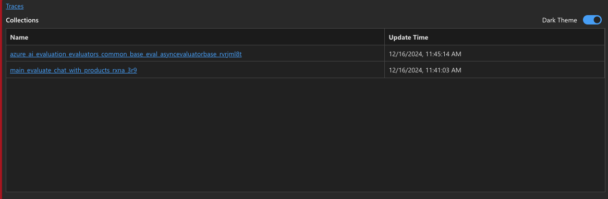

# 4.5 View Results Locally

In the previous section, we noticed that the console provided a _truncated_ summary of the results of the evaluation run. But what if you wanted to see the details or observe the traces for these runs? You have two options - **local** or **Azure AI Foundry portal**.

---

## 1. View Traces Locally

The console log from the execution run will show you a trace viewer link URL:

```bash title=""
You can view the traces in local from http://127.0.0.1:23333/v1.0/ui/traces/?#run=main_evaluate_chat_with_products_rxna_3r9_20241216_163719_733780
```

Navigate to that link in your browser, and you should get a trace viewer landing page that looks like this, with _Traces_ and _Collections_.



Click on _Traces_ - you should now be able to see records for the trace runs for each invocation of the chat application, with timestamps for each run.


Click on any row in the table to get the detailed trace view for that run - where you can drive into the call stack to understand the time taken for each call, the tokens consumer, and the inputs and outputs from each processing step.

!!! tip "COMPARE IT: Contrast the local trace view to the [Azure Foundry Portal view ](./../3-Ideate/07.md#2-view-traces-detail) seen earlier. How are they different?"


---

## 2. View Results Locally

The evaluation run provides us a summary of results in the console, but it is truncated and hard to analyze. However, observe that the results are also stored in a local JSON file that you can open up in the Visual Studio Code IDE for exploration.

Check out the `src.sample/api/myevalresults.json` for a sample file showing the outputs from a previous run. The snippet below reproduces one of the rows from those results - let's see what that provides:

1. The `inputs.query` and `inputs.truth` are from the test input file
1. The `outputs.context` reflects retrieved product documents used (RAG)
1. The `outputs.response` gives the target models returned response
1. The `outputs.groundedness.groundedness` has a rating of **1** (not grounded)
1. **The `outputs.groundedness.groundedness_reaason` explains why (context unused)**

_Note_: While the response is not grounded in the context, it does in fact reflect our prompt template guidance to ask for clarifications on questions where the intent is not clear.


!!! info "Click to expand a view a sample row from `myevalresults.json`"

    ```json title=""

        {
            "outputs.response": "Could you please specify which tents you are comparing, or do you want information about a specific tent's waterproof features?",
            "outputs.context": [
                [
                    {
                        "id": "8",
                        "content": "Welcome to the joy of camping with the Alpine Explorer Tent! This robust, 8-person, 3-season marvel is from the responsible hands of the AlpineGear brand. Promising an enviable setup that is as straightforward as counting sheep, your camping experience is transformed into a breezy pastime. Looking for privacy? The detachable divider provides separate spaces at a moment's notice. Love a tent that breathes? The numerous mesh windows and adjustable vents fend off any condensation dragon trying to dampen your adventure fun. The waterproof assurance keeps you worry-free during unexpected rain dances. With a built-in gear loft to stash away your outdoor essentials, the Alpine Explorer Tent emerges as a smooth balance of privacy, comfort, and convenience. Simply put, this tent isn't just a shelter - it's your second home in the heart of nature! Whether you're a seasoned camper or a nature-loving novice, this tent makes exploring the outdoors a joyous journey.",
                        "filepath": "alpine-explorer-tent",
                        "title": "Alpine Explorer Tent",
                        "url": "/products/alpine-explorer-tent"
                    },
                    {
                        "id": "15",
                        "content": "Introducing the OutdoorLiving SkyView 2-Person Tent, a perfect companion for your camping and hiking adventures. This tent offers a spacious interior that houses two people comfortably, with room to spare. Crafted from durable waterproof materials to shield you from the elements, it is the fortress you need in the wild. Setup is a breeze thanks to its intuitive design and color-coded poles, while two large doors allow for easy access. Stay organized with interior pockets, and store additional gear in its two vestibules. The tent also features mesh panels for effective ventilation, and it comes with a rainfly for extra weather protection. Light enough for on-the-go adventurers, it packs compactly into a carrying bag for seamless transportation. Reflective guy lines ensure visibility at night for added safety, and the tent stands freely for versatile placement. Experience the reliability of double-stitched seams that guarantee increased durability, and rest easy under the stars with OutdoorLiving's SkyView 2-Person Tent. It's not just a tent; it's your home away from home.",
                        "filepath": "skyview-2-person-tent",
                        "title": "SkyView 2-Person Tent",
                        "url": "/products/skyview-2-person-tent"
                    },
                    {
                        "id": "1",
                        "content": "Unveiling the TrailMaster X4 Tent from OutdoorLiving, your home away from home for your next camping adventure. Crafted from durable polyester, this tent boasts a spacious interior perfect for four occupants. It ensures your dryness under drizzly skies thanks to its water-resistant construction, and the accompanying rainfly adds an extra layer of weather protection. It offers refreshing airflow and bug defence, courtesy of its mesh panels. Accessibility is not an issue with its multiple doors and interior pockets that keep small items tidy. Reflective guy lines grant better visibility at night, and the freestanding design simplifies setup and relocation. With the included carry bag, transporting this convenient abode becomes a breeze. Be it an overnight getaway or a week-long nature escapade, the TrailMaster X4 Tent provides comfort, convenience, and concord with the great outdoors. Comes with a two-year limited warranty to ensure customer satisfaction.",
                        "filepath": "trailmaster-x4-tent",
                        "title": "TrailMaster X4 Tent",
                        "url": "/products/trailmaster-x4-tent"
                    },
                    {
                        "id": "14",
                        "content": "Meet the MountainDream Sleeping Bag: your new must-have companion for every outdoor adventure. Designed to handle 3-season camping with ease, it comes equipped with a premium synthetic insulation that will keep you cozy even when temperatures fall down to 15\u00b0F! Sporting a durable water-resistant nylon shell and soft breathable polyester lining, this bag doesn't sacrifice comfort for toughness. The star of the show is the contoured mummy shape that not only provides optimal heat retention but also cuts down on the weight. A smooth, snag-free YKK zipper with a unique anti-snag design allows for hassle-free operation, while the adjustable hood and full-length zipper baffle work together to ensure you stay warm all night long. Need to bring along some essentials? Not to worry! There's an interior pocket just for that. And when it's time to pack up? Just slip it into the included compression sack for easy storage and transport. Whether you're a backpacking pro or a camping novice, the MountainDream Sleeping Bag is the perfect blend of durability, warmth, and comfort that you've been looking for.",
                        "filepath": "mountaindream-sleeping-bag",
                        "title": "MountainDream Sleeping Bag",
                        "url": "/products/mountaindream-sleeping-bag"
                    },
                    {
                        "id": "9",
                        "content": "Adventure waits for no one! Introducing the HikeMate SummitClimber Backpack, your reliable partner for every exhilarating journey. With a generous 60-liter capacity and multiple compartments and pockets, packing is a breeze. Every feature points to comfort and convenience; the ergonomic design and adjustable hip belt ensure a pleasantly personalized fit, while padded shoulder straps protect you from the burden of carrying. Venturing into wet weather? Fear not! The integrated rain cover has your back, literally. Stay hydrated thanks to the backpack's hydration system compatibility. Travelling during twilight? Reflective accents keep you visible in low-light conditions. The SummitClimber Backpack isn't merely a carrier; it's a wearable base camp constructed from ruggedly durable nylon and thoughtfully designed for the great outdoors adventurer, promising to withstand tough conditions and provide years of service. So, set off on that quest - the wild beckons! The SummitClimber Backpack - your hearty companion on every expedition!",
                        "filepath": "summitclimber-backpack",
                        "title": "SummitClimber Backpack",
                        "url": "/products/summitclimber-backpack"
                    }
                ]
            ],
            "inputs.query": "Which tent is the most waterproof?",
            "inputs.truth": "The Alpine Explorer Tent has the highest rainfly waterproof rating at 3000m",
            "outputs.groundedness.groundedness": 1,
            "outputs.groundedness.gpt_groundedness": 1,
            "outputs.groundedness.groundedness_reason": "The RESPONSE does not reference any of the tents or their features from the CONTEXT, making it completely ungrounded. It fails to provide any relevant information or insights based on the provided material.",
            "line_number": 0
        },
    ```

But local results are not persistent in a way that helps us compare or process data over long periods of time. This is where having the Evaluations output stored in Azure AI Foundry portal can help.