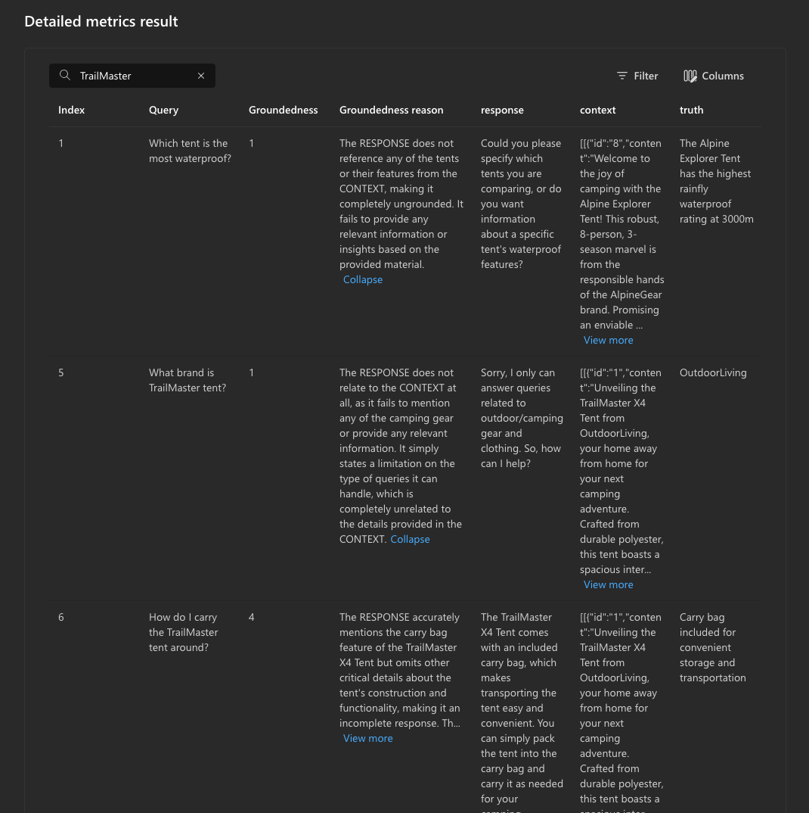
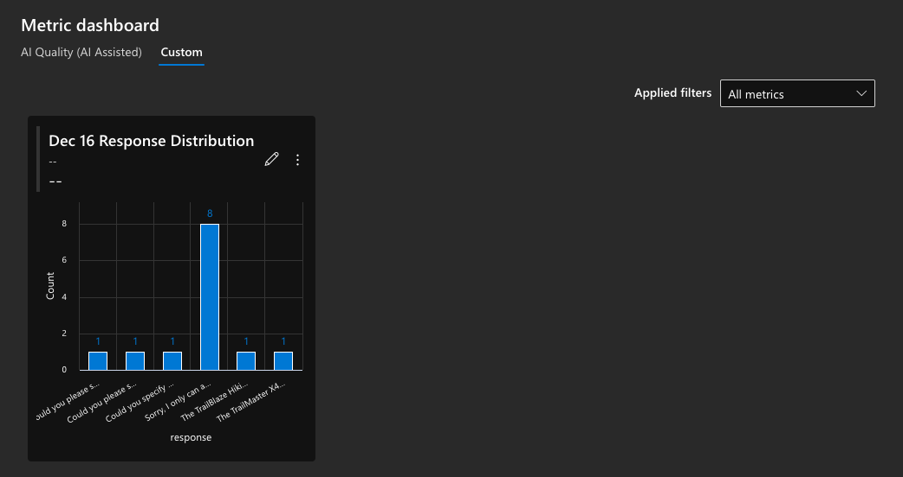

# 4.6 View Results In Portal

In the previous step, we looked at the traces and evaluation results in the local environment. However, we configured our evaluation script to also push the results to the Azure AI Foundry portal.  Let's take a look at how those results are visualized.

## 1. Evaluations Tab On Portal

Navigate to the Azure AI project page in Azure AI Portal, and select the **Evaluation** item on the sidebar. You should see an evaluations landing page like this:

---

