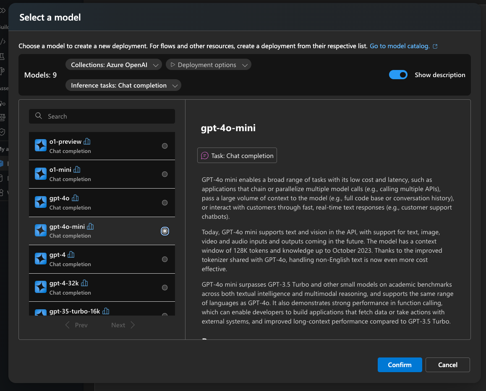
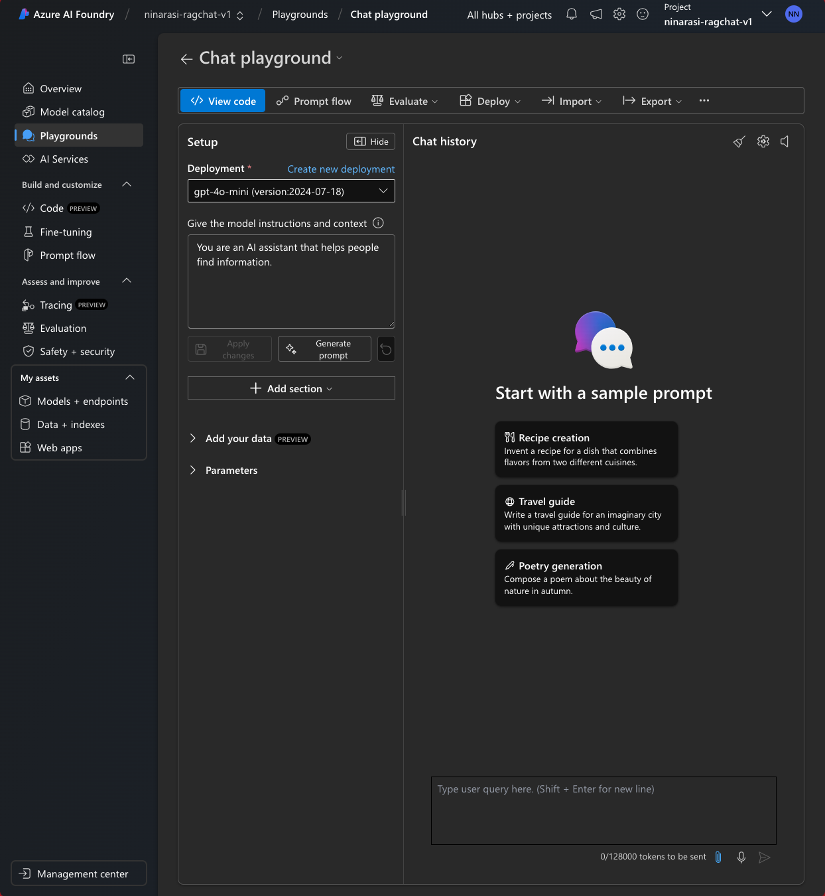
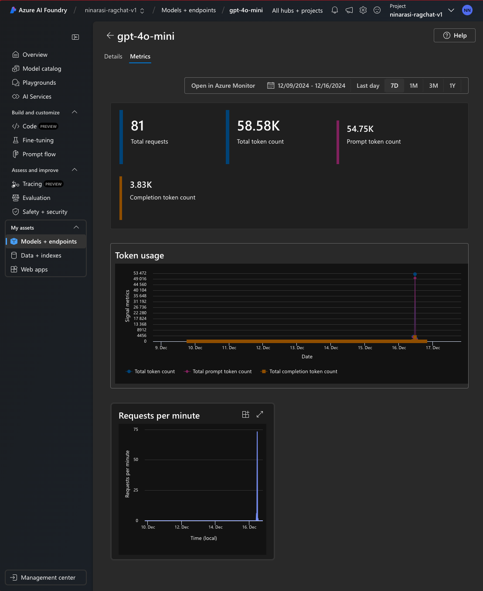
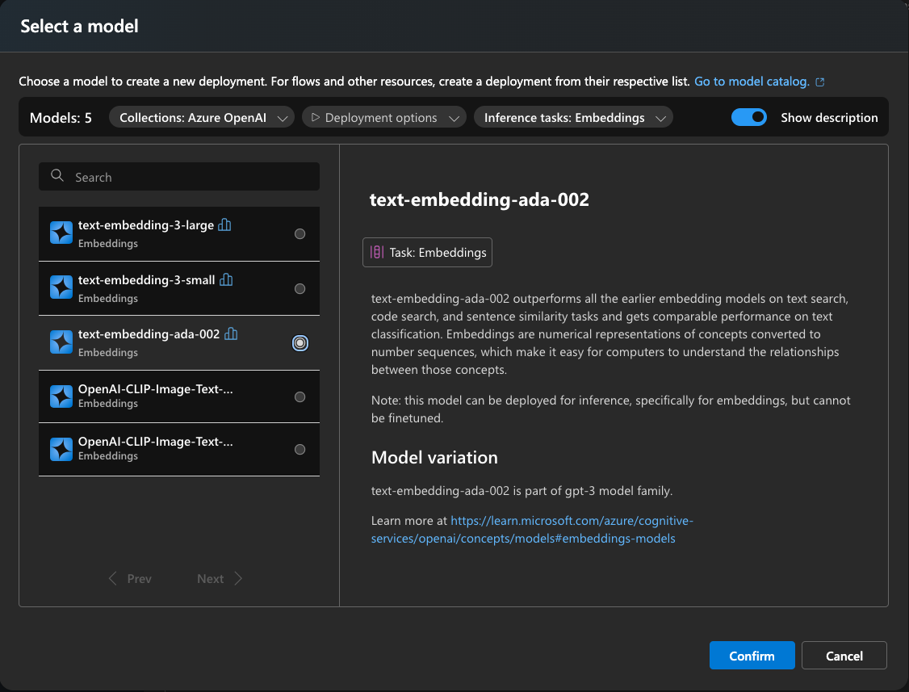

# 2.2 [Deploy AI Models](https://learn.microsoft.com/en-us/azure/ai-studio/tutorials/copilot-sdk-create-resources?tabs=macos#deploy-models)

Let's revisit our Retrieval Augmented Generation design pattern. Note that we make use of **two models** to implement this design architecture.

1. A _Large Language Model (Embedding)_ for vectorizing the user query.
1. A _Large Language Model (Chat)_ for generating the response returned to user.

---

Let's find the right models to use and deploy them to our Azure AI project so we can use them in our RAG-based copilot implementation. Start by navigating to the Azure AI Project overview page. Then select the **Models + endpoints** link under _My assets_.

---

## 1. Deploy Chat Model

### 1.1. Select A Chat Model

1. Click the blue "Deploy model" button and pick _Deploy base model_ from the dropdown options.

    

1. If you know the specific model to use, you can search for it here. In our case, let's look at what our options are. First, click the **Collections** filter and select **Azure OpenAI**. Next, click the **Inference tasks** filter and select **Chat completion**. We can see that this reduces our choices from 1800+ models in the Azure AI model catalog to **9 matching models**.

    

---

### 1.2. Deploy the Chat Model

1. We can pick any of those options as shown above, to see a _Model Card_ with more details. Let's pick `gpt-4o-mini` and click **Confirm** to get this deployment wizard. Note that it selects a _Global Standard_ deployment type by default. **The deployment has a default capacity of 10K tokens per minute (TPM)** which can be useful when we begin the evaluation phase.

1. Click on the dropdown to see other Deployment type options. [Read the documentation](https://learn.microsoft.com/en-us/azure/ai-services/openai/how-to/deployment-types#global-standard) to learn more about what each provides. [Global Standard is the recommended starting place for customers](https://learn.microsoft.com/en-us/azure/ai-services/openai/how-to/deployment-types#deployment-types) so let's go with that.

---

### 1.3. Verify Deployment

On successful deployment, you will be taken to the model deployment page where you can review the details and retrieve relevant information like the Endpoint and Key information, for use with code-first clients.

You can **Open in playground** and use the Azure AI Portal as an _ideation tool_ to explore different prompt templates, model configurations and multi-turn conversational approaches **to determine if this model is in fact suitable for your app scenario**.

!!! task "Task: Ask the model to `Tell me about hiking boots for my trip to Spain` - is response grounded?"

!!! tip "Homework: Complete the [Deploy an enterprise chat app](https://learn.microsoft.com/en-us/azure/ai-studio/tutorials/deploy-chat-web-app#add-your-data-and-try-the-chat-model-again) tutorial with your data. Is response grounded now?"

---

### 1.4. View Metrics

You can also select the _Metrics_ tab of deployed models within an Azure AI project to get metrics about the cost (tokens) and performance (requests) of that model in a given time frame. The screenshot shows the data taken for this model _after_ completing the entire project. The spike reflects the requests made during the _evaluation_ stage of the workflow.

You can also click the **Open in Azure Monitor** link to open up the Azure Monitor dashboard in the Azure Portal as shown below, allowing you to drill down into various metrics or establish dashboards to monitor trends of interest.

---

## 2. Deploy Embedding Model

The previous steps focused on the _chat completion_ model which has many choices for us to select from. Now, let's look at _embeddings_. 

### 2.1. Select & Deploy Model

**Start by setting the Inference Task to Embeddings**. 

You'll find there are only about 11 models that match this filter - setting the **Collection to Azure OpenAI** reduces this further to 5. As before, let's select a model and review the card to see if it matches our needs. 

Then **Confirm** to get the Deployment wizard dialog.

And **Deploy** to complete the workflow.

### 2.3. Verify Deployment

Similarly, we can use the deployment card to view deployment details and explore metrics. But note that we don't have a Playground for embeddings.

---

## 3. Deployment Complete

The Azure AI Project overview page will now list both models under the `Models + endpoints` tab for easy lookup later (if you want to explore metrics or engage in Playground).

---

!!! success "CONGRATULATIONS! You deployed both the AI models needed for RAG"
