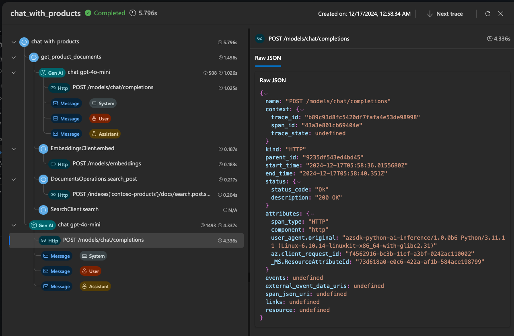

# 3.7 Test with Observability

Recall that we activated Application Insights during the setup phase of our project. This now allows to ask questions _with telemetry enabled_ and get observable traces using _open telemetry_, to help us analyze the cost or performance of our workflows.

Let's see this in action.

## 1. Enable Telemetry on Test

1. Change to the `src/api` folder 

    ```bash title=""
    cd src/api
    ```

1. Run the script:
Run the `Chat with Products` script with `--enable-telemetry` as shown.


    ```bash title=""
    python chat_with_products.py --query "I need hiking gear for a trip to Andalusia - what tents and boots do you recommend?" --enable-telemetry
    ```

1. You should see something like this in the console. Let's explore this next.

    ```bash title=""
    Enabled telemetry logging to project, view traces at:
    https://ai.azure.com/tracing?wsid=/subscriptions/XXXX/resourceGroups/ninarasi-ragchat-rg/providers/Microsoft.MachineLearningServices/workspaces/ninarasi-ragchat-v1
    💬 Response: {'content': "For your trip to Andalusia, I recommend the following tents and boots:\n\n**Tents:**\n1. **Alpine Explorer Tent**: This robust, 8-person, 3-season tent is perfect for group camping. It has multiple mesh windows for ventilation and a detachable divider for privacy. Its waterproof feature ensures you stay dry during unexpected rain.\n\n2. **SkyView 2-Person Tent**: If you're looking for a smaller option, this tent comfortably houses two people and is made from durable waterproof materials. It also features an intuitive setup system, effective ventilation, and a rainfly for extra weather protection, making it great for hiking and camping.\n\n**Boots:**\n1. **TrekReady Hiking Boots**: These boots are crafted from leather, ensuring durability and comfort on long hikes. They have a moisture-wicking lining, shock-absorbing midsoles, and excellent traction, making them suitable for various terrains.\n\n2. **TrekStar Hiking Sandals**: If you prefer something lighter and more breathable, consider these lightweight sandals. They offer adjustable straps, excellent traction, toe protection, and a cushioned footbed for comfort during summer treks.\n\nChoose based on your group size and hiking preferences, and you'll be well-prepared for your adventure in Andalusia!", 'role': 'assistant'}
    ```

---

## 2. View Traces Detail 

Look for the output section with a link as shown below, and navigate to that URL in the browser.

```bash title=""
Enabled telemetry logging to project, view traces at:
https://ai.azure.com/tracing?....

```

You should see something like this reflecting the latest run of the _Chat with Products_ script above. Click to expand the tree of nodes on the left and observe the details provided in the panel on the right, as you step through them.

1. We can _trace_ the flow of control from the user query to the returned response
1. We can _measure_ the time taken for each step to execute (in seconds)
1. We can _observe_ the cost for model invocations (in tokens) in the **GenAI** rows
1. For a given model interaction, we can explore details (system, user, assistant) to debug



---

## 3. View Traces Dashboard 

Click on the **Tracing** menu option in the sidebar to get the historical logs from previous runs. This is an effective way to analyze issues in cost or performance, make changes, then compare trace runs to see if the iterations had any impact.


---

## 4. View Traces Insights

You can also click on the `Insights for Generative AI Applications Dashboard` link (top of screen) to get a more actionable **Generative AI Application Insights (Preview)** dashboard for real-time insights and analysis of usage patterns.


