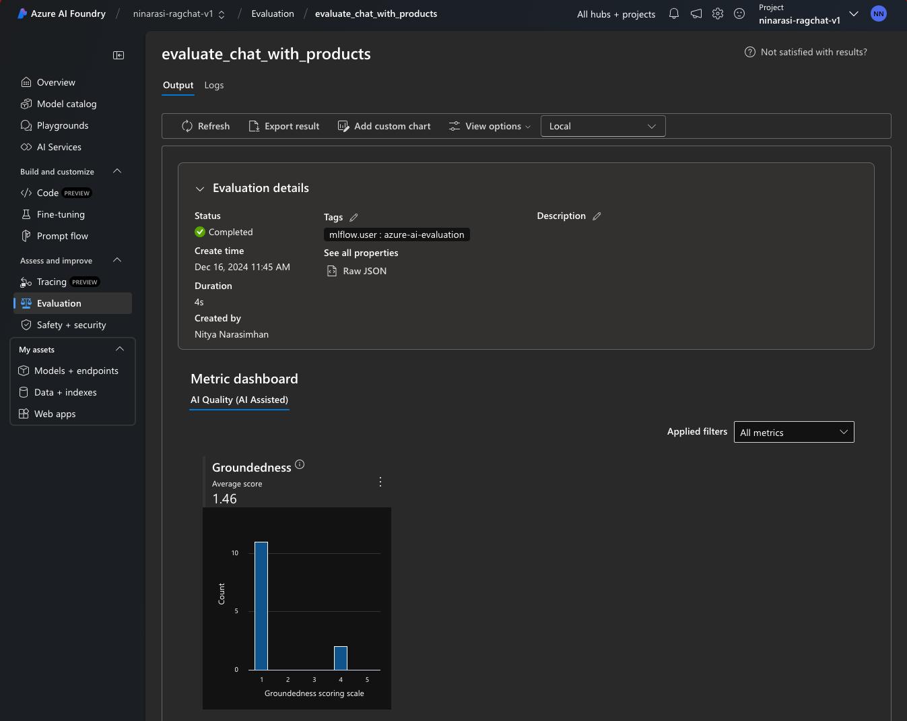

# 4.6 View Results In Portal

In the previous step, we looked at the traces and evaluation results in the local environment. However, we configured our evaluation script to also push the results to the Azure AI Foundry portal.  Let's take a look at how those results are visualized.


## 1. Evaluations Tab On Portal

Navigate to the Azure AI project page in Azure AI Portal, and select the **Evaluation** item on the sidebar. You should see an evaluations landing page like this, with the latest evaluation run listed in the table. The list entry shows the _average Groundedness_ score for that run.


---

## 2. Evaluations Results On Portal

Click on the evaluations run in the list to get this detailed dashboard view:

- The **Evaluation details** section give overall status. Click the `raw JSON` link to dive deeper.
- The **Metrics dashboard** visualizes AI Quality metrics and supports **Custom** charts.
- The **Detailed metrics result** shows evaluation results in tabular form (with search & filters)

Use the metrics dashboard to get a visual understanding of how the metrics are distributed across the evaluation results. For instance, we can see that in _our_ evaluation, 11 responses were considered _ungrounded_ and 2 were given a groundedness score of **4**. However, this does not give us insight into _why_ those scores were given.



---

## 3. Explore Detailed Metrics

This is where the detailed metrics help. We can browse through the results in tabular form, or we can drill down into the evaluations for a specific query or product using search. In this example, we see that the _TrailMaster_ product was relevant to at least 3 of the 13 queries - but the scores ranged from **1** (low groundedness) to **4** (high groundedness).


However, with _this_ view, we can drill down into the reasons for the score, and take follow up actions to improve it. For instance:

1. The first query received a low score of **1** because the response did not reference any of the tents in the provided context. But if we look deeper, we may notice that the response is actually reflecing the instructions provided in our system context - so in this case, the response was not grounded, but was relevant. 

    ```json title="src/assets/grounded_chat.prompty"
    system:
    You are an AI assistant helping users with queries related to outdoor outdooor/camping gear and clothing.
    If the question is not related to outdoor/camping gear and clothing, just say 'Sorry, I only can answer queries related to outdoor/camping gear and clothing. So, how can I help?'
    Don't try to make up any answers.
    If the question is related to outdoor/camping gear and clothing but vague, ask for clarifying questions instead of referencing documents. If the question is general, for example it uses "it" or "they", ask the user to specify what product they are asking about.
    Use the following pieces of context to answer the questions about outdoor/camping gear and clothing as completely, correctly, and concisely as possible.
    Do not add documentation reference in the response.
    ```

1. The second query received a low score of **1** which appears justified again. In this case, we note that the response reflects instructions related to questions that are off-topic - so this may be a place to investigate =why the question is seen as off-topic despite mentioning a product in the list.

1. The third query received a high score of **5** which again looks valid, given the reasoning of this being _incomplete_. However, if we look at the _truth_ and compare it to the response, we may find that it meets our expectations - and lead us to refining the evaluation prompt that defines the scoring criteria.

---

## 4. Build Custom Charts

One of the value propositions of using the Azure AI Foundry portal is the ability to create custom charts based on the evaluation results. Click the `Custom` tab and walk through the creation dialog to add visuals that reflect specific views into the data. For example, this view helps us see that a disproportionate number of responses were in the `Sorry, I only can answer queries related to ..` category, indicating that we may need to refine our chat prompt template guidance to ensure we are not rejecting valid queries.


---

## 5. Try More Evaluators

The Azure AI Foundry platform has an [Evaluator library](https://learn.microsoft.com/en-us/azure/ai-studio/how-to/evaluate-generative-ai-app#view-and-manage-the-evaluators-in-the-evaluator-library) with an extensive list of [**built-in evaluators**](https://learn.microsoft.com/en-us/azure/ai-studio/concepts/evaluation-metrics-built-in?tabs=warning) that cover risk & safety, performance & quality assessment. 


??? task "HOMEWORK: Try adding more evaluators to the script"

    To use a named evaluator - update the `evaluate.py` script to import the selected options as shown below.

    1. Import the evaluators
        ```python title=""
        from azure.ai.evaluation import F1ScoreEvaluator, RelevanceEvaluator, ViolenceEvaluator
        ```

    1. Configure them with the chosen evaluation model

        ```python title=""
        evaluator_model = {
            "azure_endpoint": connection.endpoint_url,
            "azure_deployment": os.environ["EVALUATION_MODEL"],
            "api_version": "2024-06-01",
            "api_key": connection.key,
        }
        f1score = F1ScoreEvaluator(evaluator_model)
        relevance = RelevanceScoreEvaluator(evaluator_model)
        violence = ViolenceScoreEvaluator(evaluator_model)
        ```

    1. Specify them in the call to the evaluate function

        ```python title=""
        result = evaluate(
            data=Path(ASSET_PATH) / "chat_eval_data.jsonl",
            target=evaluate_chat_with_products,
            evaluation_name="evaluate_chat_with_products",
            evaluators={
                "groundedness": groundedness,
            },
            evaluator_config={
                "default": {
                    "query": {"${data.query}"},
                    "response": {"${target.response}"},
                    "context": {"${target.context}"},
                }
            },
            azure_ai_project=project.scope,
            output_path="./myevalresults.json",
        )
        ```