# 1.2 Azure AI Foundry Portal

Let's first review key concepts and components with respect the Azure AI Foundry Portal and get a broad sense of how they connect. Two resources that can help:

- [Azure AI Foundry Documentation](https://learn.microsoft.com/en-us/azure/ai-studio/) - canonical source.
- [Azure AI Foundry Documentation Markmap](https://markmap.js.org/full#?d=github%3Anitya%2Flearns-with-markmaps%40refs%3Aheads%2Fmain%2Fdocs%2Fazure-ai-foundry.mm.md) - interactive visualization

---

## 1.2.1 Model Selection 

The [Azure AI Foundry](https://ai.azure.com/) provides developers with acces to 1800+ models (open-source, frontier, and industry-specific) for development. You can explore the [model catalog](https://ai.azure.com/explore/models) and [model benchmarks](https://ai.azure.com/explore/models/benchmarks) in **guest mode** without having to log in. Try these steps to explore the catalog (click to expand for screenshots).

??? quote "1. Visit the [Azure AI Foundry Portal](https://ai.azure.com) (_click to expand_) | 📸 "
    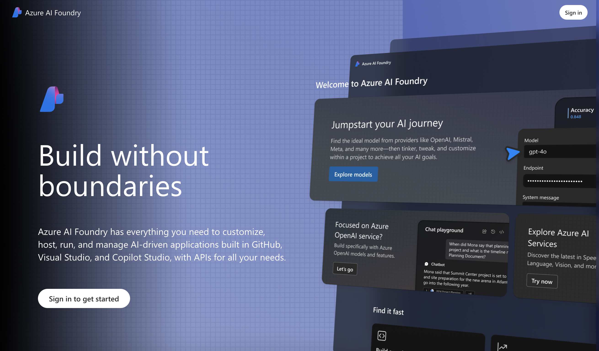

??? quote "2. Scroll down the landing page · You see "Browse models" (_click to expand_)" | 📸 "
    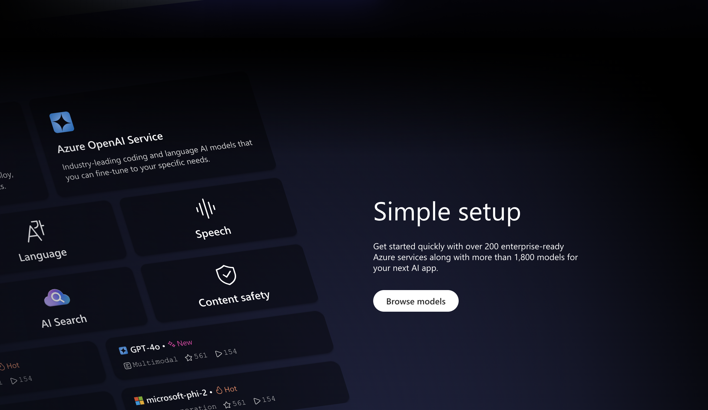

??? quote "3. Click on "Browse Models" · You see the [model catalog](https://ai.azure.com/explore/models) (_click to expand_) | 📸 "
    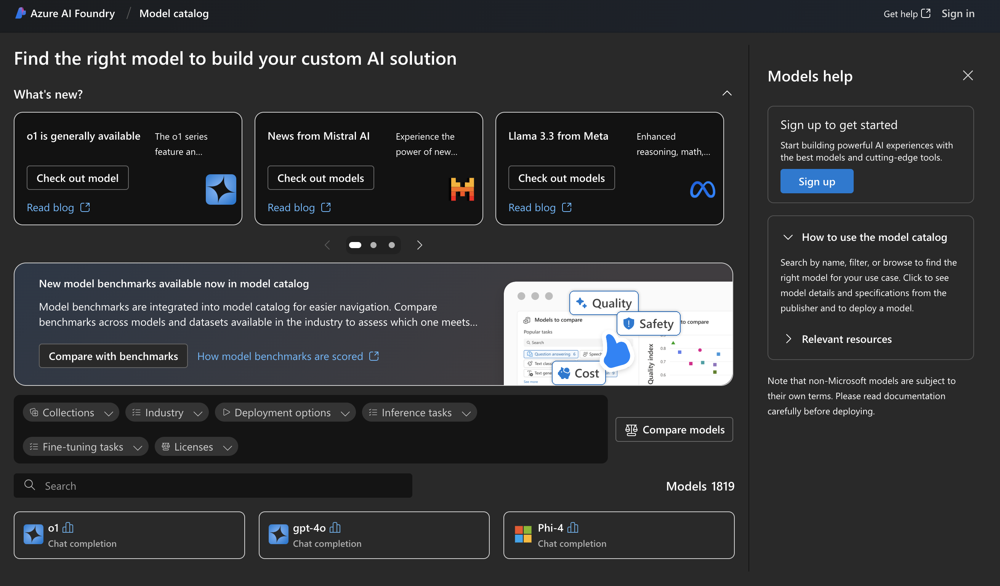

??? quote "4. Click "Compare with benchmarks"· You see the [Model benchmarks](https://ai.azure.com/explore/models/benchmarks) (_click to expand_) | 📸 "
    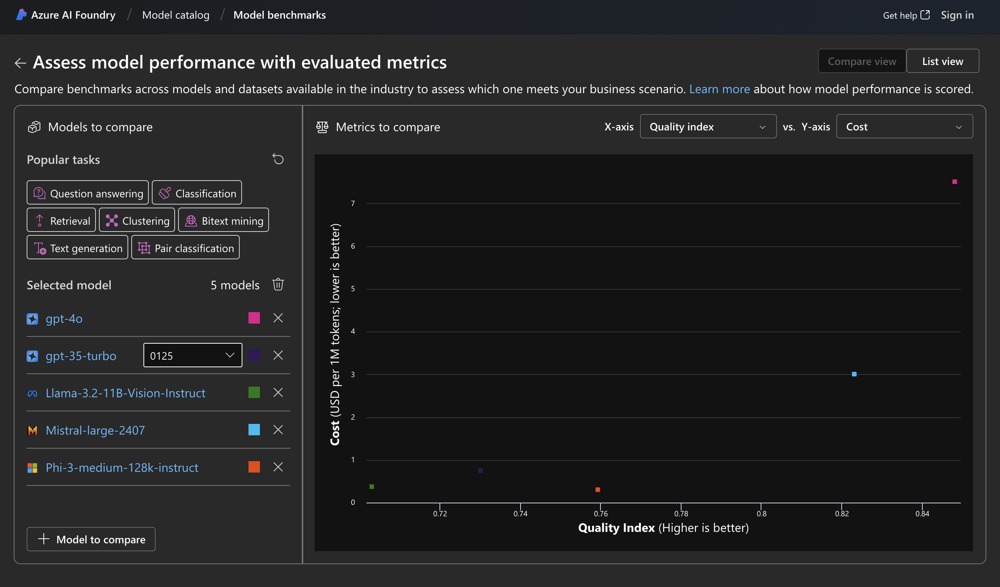

??? quote "5. Switch to "List view" in selection tab at top right. You get the list view. (_click to expand_) | 📸 "
    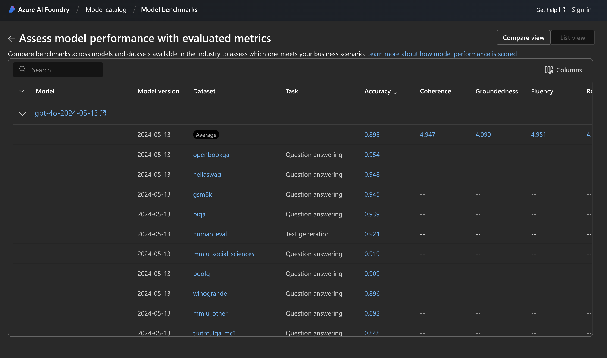

??? quote "6. Go back to [model catalog](https://ai.azure.com/explore/models) and use model filters (_click to expand_) | 📸 "
    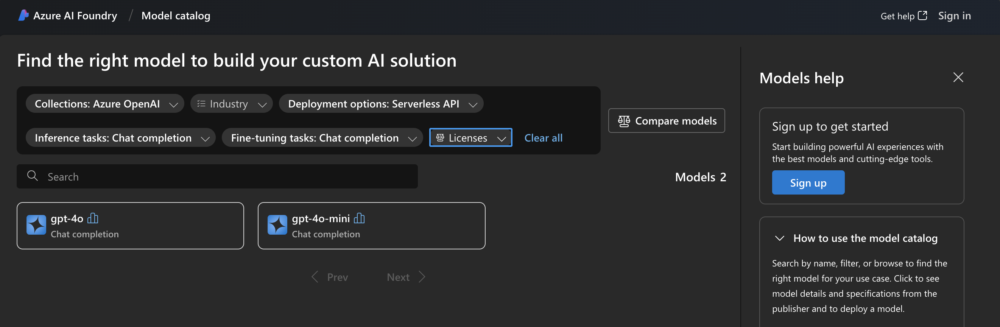

??? quote "7. Select one of the options for details - e.g., `gpt-4o-mini` (_click to expand_) | 📸 "
    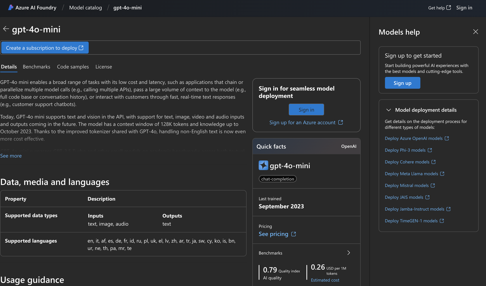

??? quote "8. Click "See pricing" to get related Pricing page if present (_click to expand_) | 📸 "
    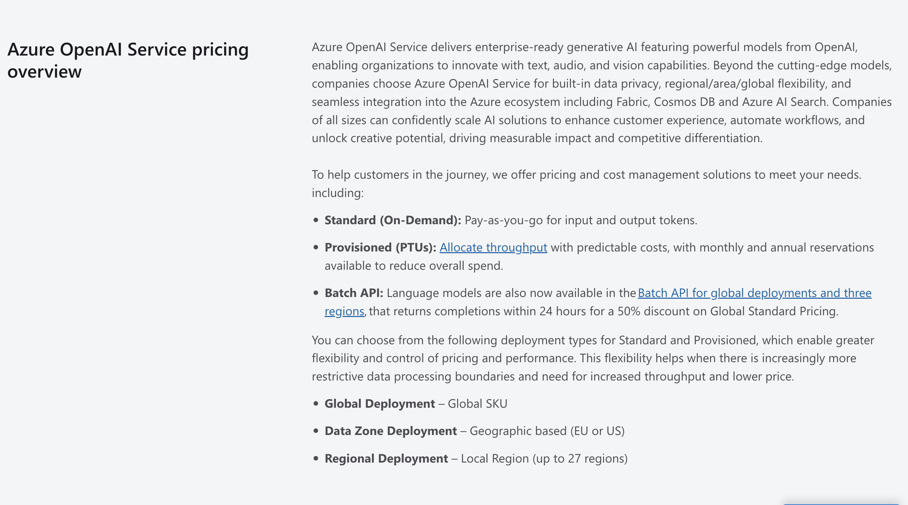

??? quote "9. Click "Estimated cost" to get relevant cost guidance if present (_click to expand_) | 📸 "
    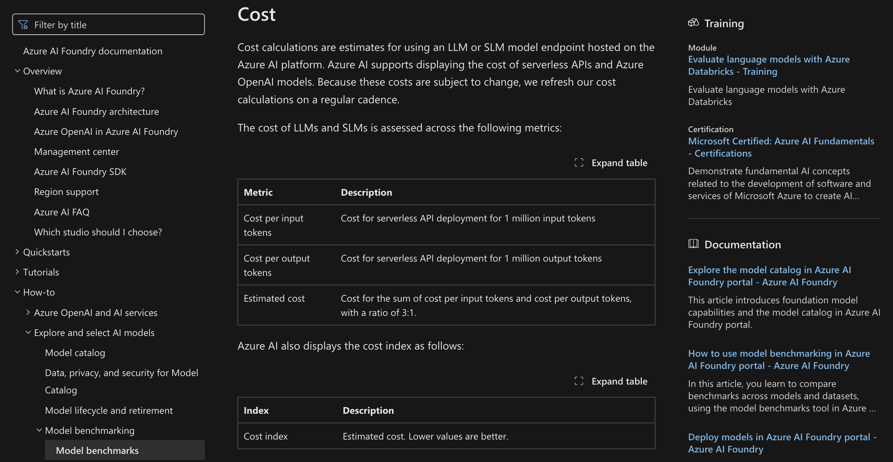

??? quote "10. Click "Benchmarks" tab to see model evaluation information if present (_click to expand_) | 📸 "
    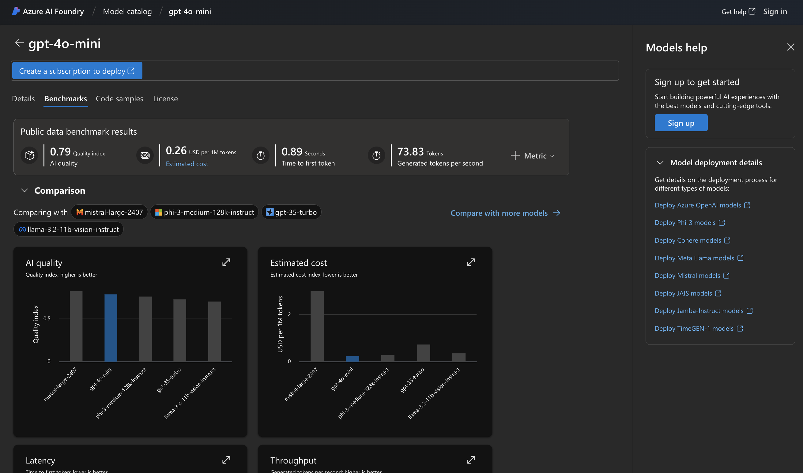

??? quote "11. Click "Code samples" tab to see code snippets for development (_click to expand_) | 📸 "
    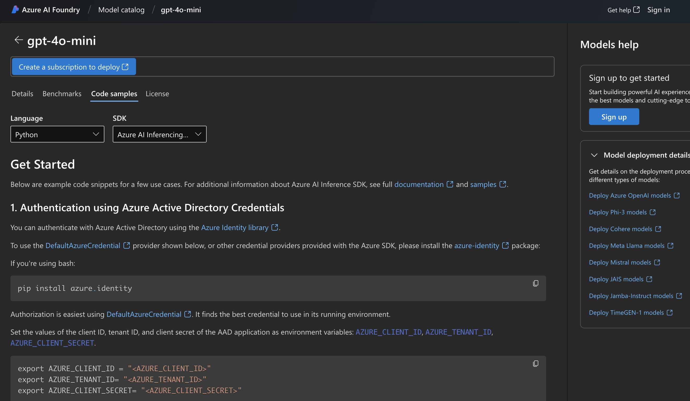

??? quote "12. Click "License" tab to see model license details (_click to expand_) | 📸 "
    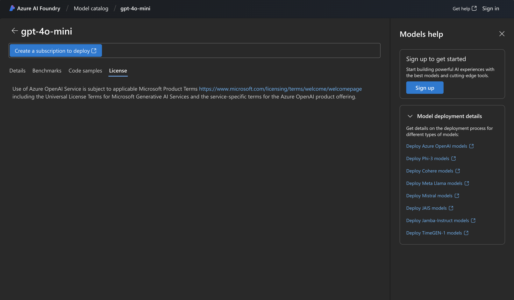

_This completes the guest tour of the Azure AI Foundry Portal. To explore further capabilities, you will need to login with an Azure subscription (as explored in next section). First, three things to know: Azure AI Foundry architecture, Azure AI Project resource, and Management Center_.

---

## 1.2.2 Foundry Architecture

!!! quote "Review this section to understand key concepts"

The Azure AI Foundry provides a unified experience to build, evaluate, and deploy, AI models.

1. Build end-to-end using a web portal (low-code), SDK (code-first) or CLI (code-agnostic). 
1. Understand **three top-level concepts:**
    - Use the Azure OpenAI **Service** to acces OpenAI models in an Azure OpenAI resource.
    - Use an AI Project for richer model catalog, developer tools, security & access control.
    - Use Management Center to configure AI hub & project - and the connected resources.
1. Azure OpenAI Resource is the key to **working with OpenAI models.**
    - Use it directly from Azure OpenAI Service or via an Azure AI Foundry project
    - Connect directly (kind=`OpenAI`) or via AI Services (kind=`AIServices`) from project.
1. Azure AI Foundry Project is key to **using full range of AI Foundry capabilities**  
    - Explore 1800+ models (open-source, frontier, industry) through model catalog
    - Connect to turnkey AI services (language, speech, document intellisense etc.)
    - Connect to content safety services (filtering, jailbreak detection etc.)
    - Connect to data & information retrieval services (AI Search, custom connections)
    - Connect to storage & security services (key vault, log analytics etc.)

??? quote "FIGURE: Understand The Azure AI Foundry Architecture (_click to expand_)"
    

---

## 1.2.3 Resource Types & Providers

An Azure resource provider is a set of REST operations that enable functionality for a specific Azure service. _Registering_ resource providers helps you define the Azure resources you can deploy to your account (subscription).

??? quote "Review this section to learn about Azure & AI resource providers _(click to expand)_"

    A resource type's name follows the format: _{resource-provider}/{resource-type}_. 

    - Example: The resource type for a key vault is `Microsoft.KeyVault/vaults`.
    - Learn More: [Azure resource providers and types](https://learn.microsoft.com/en-us/azure/azure-resource-manager/management/resource-providers-and-types)
    - Learn More: [Azure AI Foundry resource providers and types](https://learn.microsoft.com/en-us/azure/ai-studio/concepts/architecture#azure-resource-types-and-providers)

### 1.2.3.1 AI Resource Providers
The Azure AI Foundry is built on the Azure Machine Learning resource provider, and takes a dependency on several other Azure services. 

??? quote "View the list of REQUIRED resource providers for Azure AI.  _(expand to view)_"

    1. `Microsoft.MachineLearningServices/workspace (kind=hub)` - for hub
    1. `Microsoft.MachineLearningServices/workspace (kind=project)` - for project
    1. `Microsoft.CognitiveServices/account (kind=AIServices)` - for AI services
    1. `Microsoft.CognitiveServices/account (kind=AIServices OR OpenAI)` - for AOAI Service
    1. `Microsoft.Storage/storageAccounts` - for storing artifacts
    1. `Microsoft.KeyVault/vaults` - for storing secrets

??? quote "View the list of ADDITIONAL resource providers useful for RAG.  _(click to expand)_"

    1. `Microsoft.Search/searchServices` - for search & retrieval
    1. `Microsoft.ContainerRegistry/registries` - for registering docker images
    1. `Microsoft.Insights/components` -  for app insights & log analytics
    1. `Microsoft.OperationalInsights/workspaces` - for app insights & log analytics

### 1.2.3.2 Registering Providers

Some resource providers are registered by default. Others get registered on specific actions (e.g., deploy azd template with providers defined). Others need to be registered manually. **You can view and update provider registrations** using the Azure Portal or the Azure CLI.

??? quote "Learn how to view, update, and troubleshoot, provider registration _(click to expand)_"

    Let's use the Azure Portal for convenience - follow the guidance below 

    - [View resource provider details](https://learn.microsoft.com/en-us/azure/azure-resource-manager/management/resource-providers-and-types#view-resource-provider) - learn what each provider above does
    - [Register resource provider](https://learn.microsoft.com/en-us/azure/azure-resource-manager/management/resource-providers-and-types#register-resource-provider-1) - check registration status & register it (if needed)
    - [Troubleshoot provider errors](https://learn.microsoft.com/en-us/azure/azure-resource-manager/troubleshooting/error-register-resource-provider?tabs=azure-portal) - debug causes of common registration errors

---

## 1.2.4 Project & Hub Resources

[Hubs and projects](https://learn.microsoft.com/azure/ai-studio/concepts/ai-resources) are the key to building AI solutions end-to-end on Azure AI Foundry, using its full spectrum of models, tools, and connected resources.

1. The Azure AI Foundry `hub` is the top-level resource for managing projects - _for admins_.
1. The Azure AI Foundry `project` is the top-level resource for building apps - _for developers_.
1. The hub creates & configures connected resources - which projects then use seamlessly.
1. Every project **must** have a parent hub. Every hub **may** have one or more child projects.
1. Hubs are **collaboration** environments (team). Projects are **development** environments (app).

??? quote "FIGURE: Understand how AI hub, project, and services, resources interact _(click to expand)_"
    

---

## 1.2.5 Management Center

The [Management Center](https://learn.microsoft.com/en-us/azure/ai-studio/concepts/management-center) provides a centralized location to manage governance and management tasks for your AI projects. To view the Management Center, visit the Azure AI project page and look for the _Management Center_ option on the sidebar (bottom, left). 

??? quote "FIGURE: View Management Center for an example Azure AI project _(click to expand)_"
    

    Here are the main tasks you can accomplish here:

    1. [Manage hubs and projects](https://learn.microsoft.com/en-us/azure/ai-studio/concepts/management-center#manage-hubs-and-projects) - create & configure resource at both levels.
    1. [Manage resource utilization](https://learn.microsoft.com/en-us/azure/ai-studio/concepts/management-center#manage-resource-utilization) - view and manage quota usage (with metrics)
    1. [Manage access and governance](https://learn.microsoft.com/en-us/azure/ai-studio/concepts/management-center#govern-access) - add/remove users and assign/remove roles for compliance.

---

## 1.2.6 Portal Comparisons

1. [Azure AI Foundry Portal](https://learn.microsoft.com/en-us/ai/ai-studio-experiences-overview#is-azure-ai-foundry-portal-right-for-you) is for developers. Build generative AI Applications.
1. [Azure Machine Learning Studio](https://learn.microsoft.com/en-us/ai/ai-studio-experiences-overview#is-azure-machine-learning-studio-right-for-you) is for ML Engineers and Data Scientists. Build AI models.
1. [Azure Portal](https://learn.microsoft.com/en-us/azure/azure-portal/azure-portal-overview) is for IT Professionals and Admininstrators. Manage infrastructure.