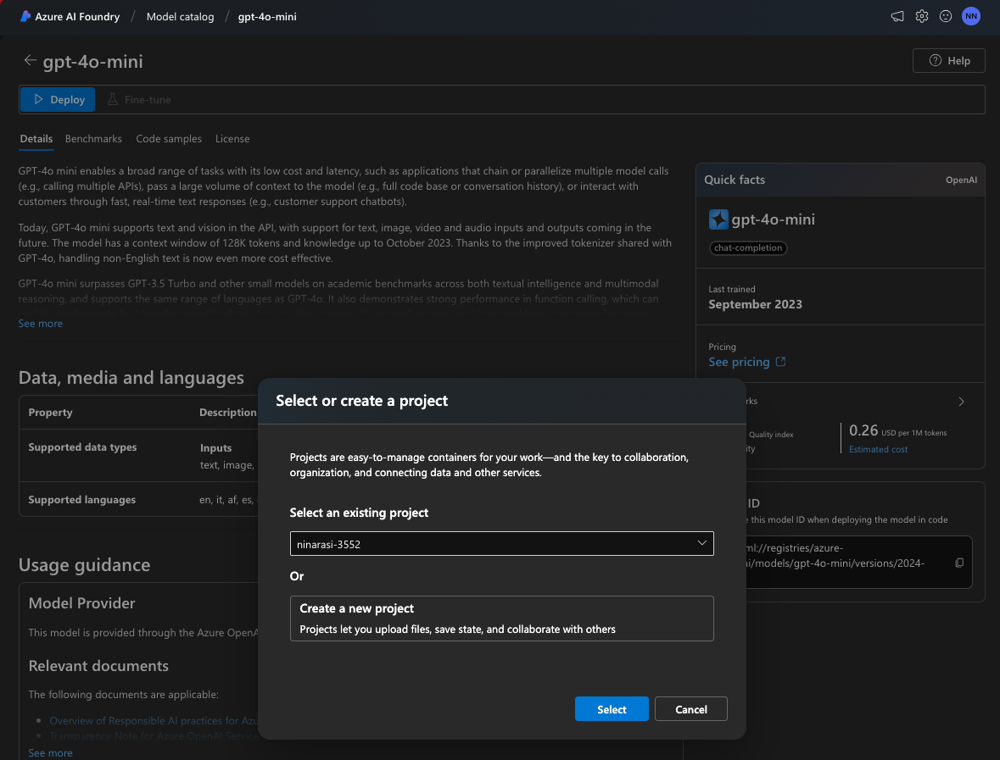

# 1. Lab: Model Selection

??? info "GENAIOPS: Model Selection is part of the _Getting Started_ stage. (click to view figure)"
    

Models are the brains of our generative AI applications. The first step of your end-to-end developer workflow is _model selection_. This consists of three steps:

1. Discovery - see if there exists an AI model for your need.
1. Selection - choose the right model from available matches.
1. Usage - deploy, customize, and evaluate, the model for fit.

The Azure AI Foundry portal helps support the model selection journey with three features:

1. [Model catalog](https://learn.microsoft.com/en-us/azure/ai-studio/how-to/model-catalog-overview) - for discovery
1. [Model benchmarks](https://learn.microsoft.com/en-us/azure/ai-studio/concepts/model-benchmarks) - for comparison
1. [Model deployment](https://learn.microsoft.com/en-us/azure/ai-studio/concepts/deployments-overview) - for evaluation

!!! quote "By the end of this section you should know how to:"

    - [X] Filter the model catalog to discover relevant models
    - [X] Compare selected models using the model benchmarks
    - [X] Select a model and explore its model card for details
    - [X] Start a model deployment to experiment with it in Azure

---

## 1.1 Model catalog

The Azure AI Foundry model catalog is the starting point for model selection. It currently has 1800+ frontier, industry, and open-source, models that can be filtered by collection, industy, deployment option, inference task, and license. You can also take advantage of the built-in search capability to find models by name or other criteria. Let's explore this.

Start by opening a new private browser in guest mode and navigating to the [Azure AI Model catalog](https://ai.azure.com/explore/models) page in Azure AI Foundry. You should see this: 

??? info "FIGURE: click to expand for example screenshot. **Note model count** (ex: 1819 models)"
    

---

### 1.1.1 Filter By Inference Task

The first step is to see if the catalog has _any_ models that will fit your specific needs. Typically, this will involve knowing the **inference task** you want to perform, and **filtering** the catalog to see matching options. Inference tasks can fall under various categories like:

- natural language processing (e.g., text generation, question answering),
- computer vision (e.g., image classification, image segmentation)
- audio (text-to-speech, audio generation) 
- multimodal (visual question answering, document question answering) etc.

!!! task "Filter the catalog by a specific inference task to see matching models"

1. Filter by [Text generation](https://ai.azure.com/explore/models?selectedTask=text-generation) → see: 375+ models
1. Filter by [Embeddings](https://ai.azure.com/explore/models?selectedTask=embeddings) → see: 11+ models
1. Filter by [Chat completion](https://ai.azure.com/explore/models?selectedTask=chat-completion) → see: 62+ models

---

### 1.1.2 Filter By Deployment Type

Now let's look at the first filter (text generation) - this gives us 375+ results that match. How can we filter this down further? One way is to filter by deployment options. 

- [Managed compute](https://learn.microsoft.com/en-us/azure/ai-studio/how-to/deploy-models-managed) - provides a managed online endpoint (API) in a provisioned VM.
- [Serverless API](https://learn.microsoft.com/en-us/azure/machine-learning/how-to-deploy-models-serverless?view=azureml-api-2&tabs=azure-studio) - provide pay-as-you-go billing and a models-as-a-service (MaaS) approach.

The serverless API option can be more cost-effective and does not consume your model quota while still providing enterprise security and compliance guarantees. Let's try this out:

!!! task "Filter the catalog by a inference task & deployment type to see matching models"

1. First, Filter by [Text generation](https://ai.azure.com/explore/models?selectedTask=text-generation) → see: 375+ models
1. Then, Filter By [Serverless API](https://ai.azure.com/explore/models?selectedTask=text-generation&selectedDeploymentTypes=serverless-inference) deployment → see: 3 models (manageable subset)

---

### 1.1.3 Filter By Collection Type

Another way to filter models is by _collection_. At a high level, there are 3 key collections:

- [Curated by AI](https://ai.azure.com/explore/models?selectedCollection=-curated-by-azure-ai-,aoai,phi,meta,mistral,nvidia,ai21,deci,nixtla,core42,cohere,databricks,snowflake,sdaia,paige,bria,nttdata,saifr,rockwell,bayer,cerence,sightmachine) - frontier models that have been scanned for vulnerabilities.
- [Hugging Face](https://ai.azure.com/explore/models?selectedCollection=huggingface) - open-source model variants from the community
- [Benchmark Results](https://ai.azure.com/explore/models?selectedCollection=-benchmark-results-) - models that we can compare benchmarks on

You can also select a specific model provider in the collections filter, to see only models from that provider. This is a particularly useful filter to use if you want to prioritize using an **open-source** model, or want to pick models that you can compare benchmarks on. Let's try it.

!!! task "Filter the catalog by inference task and benchmark results collection to see matching models"

1. First, Filter by [Text generation](https://ai.azure.com/explore/models?selectedTask=text-generation) → see: 375+ models
1. Then, Filter By [Benchmark Results](https://ai.azure.com/explore/models?selectedTask=text-generation&selectedCollection=-benchmark-results-) collection → see: 22 models (that I can compare)
1. OR Filter by [Hugging Face](https://ai.azure.com/explore/models?selectedTask=text-generation&selectedCollection=huggingface) → see: 322 models (that are open-source)

---

### 1.1.4 Filter By Industry Domain

Last but not least, we now have a specialized filter for Industry, allowing you to select models that have been specifically curated and tailored for use in vertical domains like Health and Life Sciences, Financial Services etc. Because these are industry-specific, they can be more effective as the _first_ filter for discovery. Let's try it.
 

!!! task "Filter the catalog by a industry to see matching models"

1. Filter by [Financial Services](https://ai.azure.com/explore/models?selectedIndustryFilter=financial-services) → see: 10 models _including Saifr_ → Clear results
1. First,Filter by [Health & Life Sciences Industry](https://ai.azure.com/explore/models?selectedIndustryFilter=health-and-life-sciences) → see: 20 models 
1. Then, Filter by [Embeddings Inference Task](https://ai.azure.com/explore/models?selectedIndustryFilter=health-and-life-sciences,financial-services) → see: 2 models 

### 1.1.5 Filter By Fine-Tuning Task

Model selection is typically followed by model **customization** - using prompt engineering, retrieval augmented generation, or fine-tuning - to improve the model response to suit your application quality and safety criteria. [Fine-tuning](https://learn.microsoft.com/en-us/azure/ai-studio/concepts/fine-tuning-overview) works by performing _additional training_ on an existing pre-trained model using a relevant new dataset to enhacne performance or add new skills.

Currently only a subset of models in the catalog can be fine-tuned, and these may have [added constraints](https://learn.microsoft.com/en-us/azure/ai-studio/concepts/fine-tuning-overview#supported-models-for-fine-tuning) like regional availability for fine-tuning. Let's see how this works.

!!! task "Filter the catalog by for a fine-tuning model for text generation"

1. Filter by [Text generation for INFERENCE](https://ai.azure.com/explore/models?selectedTask=text-generation) → see: 375+ models → Clear results
1. Filter by [Text generation for FINE-TUNING](https://ai.azure.com/explore/models?selectedFineTuningTask=text-generation) → see: 14 models
1. Then, Filter by [Serverless API Deployment](https://ai.azure.com/explore/models?selectedFineTuningTask=text-generation&selectedDeploymentTypes=serverless-inference) → see: 3 models (Llama-2)

---

### 1.1.6 Search By Keyword

Sometimes, the predefined filters are not sufficient to reduce the model subset to a manageable level for manual evaluation. This can be for various reasons:

1. You want to see if the catalog _has a specific model name_.
1. The model inference task _may not be a standard option_.
1. You want to see if there are models _with a specific capability_.

!!! task "Example 1 (Taxonomy mismatch) - search by category name" 

1. First, look for [Embeddings](https://ai.azure.com/explore/models?selectedTask=embeddings) inference task. → see: 10 models (no Hugging Face)
1. Now, search for "Sentence Similarity" ([HF taxonomy](https://huggingface.co/tasks/sentence-similarity)) → see: 7 open-source models 

!!! task "Example 2 (Known entity) - search by name" 

1. Search for "smol"  → see: 1 model = flagship SLM from Hugging Face 
1. Search for "unsloth"  → see: 2 models = from specific community creator

!!! task "Example 3 (Other keywords) - search by capability" 

1. Search for "sql"  → see: 2 models = create sql queries using natural language
1. Search for "biomed" → see: models = focus on biomedical applications & data

---

## 1.2 Model Benchmarks

### 1.2.1 Filter By Benchmarks

For RAG architectures, we need a _chat completion_ model and an _embedding_ model. To select a model for prototyping, we'll filter by inference task, then look for models with benchmarks, then compare a few by available metrics to make a decision. **Let's find our chat model**:

1. Filter by [Chat Completion](https://ai.azure.com/explore/models?selectedTask=chat-completion) → see: 62 models 
1. Now, Filter by [Benchmark Results](https://ai.azure.com/explore/models?selectedTask=chat-completion&selectedCollection=-benchmark-results-) → see: 51 models 
1. You should see something like this:

    ??? info "FIGURE: click to expand for example screenshot"
        

1. Click **Compare Models** → see: [Assess model performance with evaluated metrics](https://ai.azure.com/explore/models/benchmarks) 

Let's use this page to compare the model options by available benchmarks.

---

### 1.2.2 Compare By Benchmarks

In the previous step, we saw 51 choices that included the 4 models below. 

- _gpt-4o, gpt-4o-mini, AI21-Jamba-1.5-Mini, and Phi-3-mini-128k-instruct_.

Let's use these as a sample for an exercise in using benchmarks for model selection.

1. The [Benchmarks Compare View](https://ai.azure.com/explore/models/benchmarks) will have default models selected. **Delete the defaults.**
1. Now, add the 4 models above (one at a time) using the `+ Model to compare` button.
1. You should see something like this:

    ??? info "FIGURE: click to expand for example screenshot"
        

1. Explore the available critera for comparisons (click each drop-down in the chart)
    - Criteria include: _quality_, _embeddings_, _cost_ and _latency_. 
1. Select _Accuracy_ for x-axis and _Cost_ for y-axis as shown in figure above
    - The chart will update to show where models fit on this comparison
    - Higher accuracy values - and lower cost values - are better.
1. Observe the chart. We can see:
    - the `AI21-Jamba-1.5-Mini` model costs the least but is also the least accurate
    - the `gpt-4o` model has the highest accuracy but also the highest cost.
    - the `gpt-4o-mini` has comparable cost to (1) and is second in accuracy to (2).
1. Make an informed decision: select `gpt-4o-mini` 
    - we'll review the Model card in the next section to determine next steps.

!!! task "HOMEWORK: Walk through a similar process to select an **embedding** model."

---

### 1.2.3 List By Benchmarks

The compare view above lets you assess model choices relative to each other based on specific criteria like accuracy, cost and other metrics. The **list view** provides more detailed metrics for each model, giving insights into their effectiveness for various tasks. Learn more:

1. [Benchmarking of LLMs and SLMs](https://learn.microsoft.com/en-us/azure/ai-studio/concepts/model-benchmarks#benchmarking-of-llms-and-slms).

1. [Benchmarking of embedding models](https://learn.microsoft.com/en-us/azure/ai-studio/concepts/model-benchmarks#benchmarking-of-embedding-models).

Let's explore this briefly for the `gpt-4o-mini` model we selected earlier.

1. Search for the model by name as shown below. You should see:
    - A row of benchmarks for that model, each with a model version and associated dataset
    - Each row has columns for relevant quality metrics (with values, where assessed)
    - The top row provides the _average_ for each metric, across all assessed benchmark
    ??? info "FIGURE: click to expand for example screenshot"
        

1. We see this model ranks well on accuracy and prompt-based metrics like coherence, fluency, and groundedness - but does less well on GPTSimilarity. See: [Quality docs](https://learn.microsoft.com/en-us/azure/ai-studio/concepts/model-benchmarks#quality) for explainers on what each metric means. _Overall, we see the selected model quality is acceptable_.
1. Each row of benchmarks for a model defines a _dataset_ and a _task_. The dataset contains examples of inputs relevant to the task, along with information to assess quality of model response to that input. The resulting quality metrics are listed in that row. Click on a dataset to get more details on what it does, and how.

    - Ex 1: Click `human_eval` which assesses _accuracy_ for Text generation tasks
        - it assesses functional correctness of _code generation_ from given word problem.
        - it assesses this model at 0.841 accuracy for this text generation task.

        ??? info "FIGURE: (click to expand) Dataset details for `HumanEval`"
            

    - Ex 2: Click `squad_v2` which assesses _groundedness_ and _relevance_ for QA tasks
        - it assesses _reading comprehension_ using questions on a Wikipedia dataset.
        - it assesses this model at 4.146 for Groundedness and 3.753 for GPTSimilarity.

        ??? info "FIGURE: (click to expand_ Dataset details for `squad_v2`"
            

This allows us to get a quick sense of the _general suitability_ of the selected model based on benchmarks. The next step, is to explore the model card.

---

## 1.3 Model card

The model card for a selected model provides all the necessary information to help you understand its capabilities, pricing, quality and more. And, it provides the starting point for **deploying** the model to explore it interactively.

### 1.3.1 Overview

1. Click the [gpt-4o-mini](https://ai.azure.com/explore/models/gpt-4o-mini/version/2024-07-18/registry/azure-openai) result to navigate to the model card in Azure.

    -  You should see this - note the links to pricing and estimated cost.

        ??? info "FIGURE: (click to expand) Model Card Overview (Details tab - top)"
            

    - Scroll down. You see model provider details on tasks and benchmarks of relevance.

        ??? info "FIGURE: (click to expand) Model Card Overview (Details tab - bottom)"
            

### 1.3.2 Benchmarks

1. Click the `Benchmarks` tab in the model card. 
    
    - The top half of the page provides this view. Clicking [Compare with other models](https://ai.azure.com/explore/models/benchmarks?modelId=gpt-4o-mini) takes you to the Benchmarks view from earlier, but with this model as main focus (and other example models for comparison).

        ??? info "FIGURE: (click to expand) Benchmarks tab - compare other models"
            

    - Scroll down. You should see options to try evaluating the model with your own data.

        ??? info "FIGURE: (click to expand) Benchmarks tab - try with your own data"
            

### 1.3.3 Deployment

1. Click the `Code samples` tab in the model card. You should see code snippets for using this model _programmatically_ with the Azure AI Inference SDK, for various languages. **But what if you want to explore this model in a playground in the portal?**
    
    ??? info "FIGURE: (click to expand) Code Samples tab - pick your language"
        

1. Click the `Details` tab to get back to the overview (guest mode). Note the `Create a subscription to deploy` button indicating we need to log into Azure before we can proceed. Let's do that next.

    ??? info "FIGURE: (click to expand) Model Card Overview (Guest Mode)"
        

1. Logging in gives us a `Deploy` button as shown. Clicking that now gives you the choice of deploying the model to an _existing_ project, or _creating a new project_ for this purpose.

    ??? info "FIGURE: (click to expand) Model Card Overview (Authenticated)"
        

In the [next lab](Lab-02.md) we'll continue from this point to explore Project setup and model deployment. But first, a quick note on data, privacy, and security considerations when working with models in the Azure AI model catalog.

---

## 1.3 Data, Privacy, & Security

When you deploy and customize models in the Azure AI Foundry portal, the service processes data in different contexts. These include:

1. **Prompts** - the initial user request, as well as metaprompts and RAG-enhanced context.
1. **Generated Content** - the response generated by the model, potentially as chat history.
1. **Uploaded Data** - loaded into a datastore for fine-tuning or other AI customization.
1. **Content Filters** - analyze prompts and responses to detect and filter harmful content.

Some of the common questions on data security and privacy are:

- Is the data stored, shared with providers, or reused for training?
- Who is processing the data, and what are their data commitments?

To learn more, check out these two core resources:

1. [Data, privacy, and security for use of models through the model catalog](https://learn.microsoft.com/en-us/azure/ai-studio/how-to/concept-data-privacy)
1. [Data, privacy, and security for Azure AI Content Safety](https://learn.microsoft.com/en-us/legal/cognitive-services/content-safety/data-privacy)

---

_This completes the guest tour of the Azure AI Foundry Portal. To explore further capabilities, you will need to login with an Azure subscription (as explored in next section). First, three things to know: Azure AI Foundry architecture, Azure AI Project resource, and Management Center_.