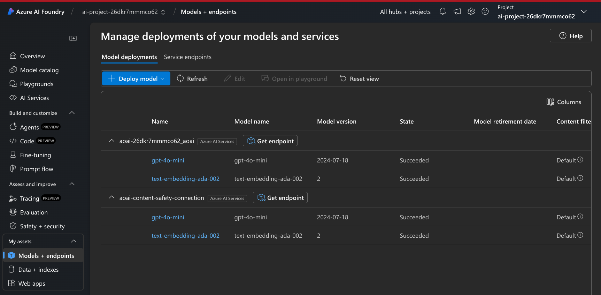

# 1.3 Azure AI Template

!!! note "The Azure AI Foundry [Code Preview](https://ai.azure.com/build/code) tab in an active Azue AI project will list 3 azd-capable templates, one of which is the [Get started with Azure AI](https://github.com/Azure-Samples/azureai-basic-python) basic starter template. We'll use this as our reference in this tutorial."

## 1. Before We Begin

Let's look at what our default folder structure looks like. You should see the following. Make note of this so we can identify the new folders/files that get added when we "azd init" the repo.

```bash title="" linenums="0"
.devcontainer/   # Launch pre-build dev environment in GitHub Codespaces
.github/         # Add workflows for automated CI/CD actions
data/            # Contains data for AI application needs
docs/            # Contains documentation for AI application workshop
src.sample/      # Contains app code (working sample)
env.sample/      # Contains env variables (placeholder sample)
.gitignore       # Contains .gitignore rules
LICENSE          
mkdocs.yml       # Configuration for mkdocs documentation site
README.md        # README for repo
REFERENCES.md    # REFERENCES for repo
requirements.txt # Python dependencies for application

```

## 2. View AI Template

Let's take a look at what the folder structure for the [Get started with Azure AI](https://github.com/Azure-Samples/azureai-basic-python) basic starter template looks like by visiting that repo:

```bash title="" linenums="0"
.azdo/pipelines/        # Azure DevOps pipelines 
.devcontainer/          # Dev Container configuration
.github/                # GitHub Actions workflows
docs/                   # README assets and docs
infra/                  # Infrastructure-as-code assets
scripts/                # Scripts for azd hooks 
src/                    # Application source
.gitignore
.pre-commit-config.yaml # Pre-commit hooks: code quality checks
LICENSE
README.md
azure.yaml               # Azure Developer CLI configuration
pyproject.toml           # Python Project configuration
requirements-dev.txt     # Python Project package dependencies
```

## 3. Initialize Template

To use that template, we need to run the right azd command in our repo.

!!! info "**Note**: In this case we are retrofitting an existing sample using the azd template." 

    This means we have to reconcile conflicts in files like `.devcontainer.json` which get overwritten by the `azd init` process when using an existing template. This leads to the roundabout process described below. Instead you can also start with an empty repository and initialize the template first - then refactor the contents step by step to reflect your application needs. We can explore that approach later.


### 3.1 Create Sandbox 
 Let's see what happens when we run this at the root of our existing folder:

```bash title="" linenums="0"
azd init -t azureai-basic-python
```

You should see a warning like this:

```bash title="" linenums="0"
Initializing an app to run on Azure (azd init)

WARNING: The current directory is not empty.
Initializing an app in this directory may overwrite existing files.

? Continue initializing an app in '/workspaces/azure-ai-rag-workshop'? (y/N) 
```

We don't want this to happen since we are using the `.devcontaine/`, `.github/`, `LICENSE`, `README.md` and `docs/` filenames for our own content. Instead, let's see what happens when we run this in a _sandbox_ directory. We can then compare the contents and move them into the root folder in a more informed manner.

```bash title="" linenums="0"
mkdir SANDBOX
```
```bash title="" linenums="0"
cd SANDBOX/
```

### 3.2 Run `azd init`

```bash title="" linenums="0"
azd init -t azureai-basic-python
```

You now see something like this:

```bash title="" linenums="0"

Initializing an app to run on Azure (azd init)
  (✓) Done: Downloading template code to: /workspaces/azure-ai-rag-workshop/SANDBOX

? Enter a new environment name: [? for help] 
```

At this point, if you view the `SANDBOX/` folder in the explorer sidebar on VS Code, you will see the file structure from [the template view](#2-view-ai-template) replicated here, along with an empty `.azure/` folder.

### 3.3 Complete init

Let's continue with the `azd init` wizard workflow by providing an environment name. Let's pick _ragchat-aip_ as a symbolic name for the RAG Chat app on the Azure AI Platform. You should now see this:

```bash title="" linenums="0"
? Enter a new environment name: ragchat-aip

SUCCESS: New project initialized!        
You can view the template code in your directory: /workspaces/azure-ai-rag-workshop/SANDBOX
Learn more about running 3rd party code on our DevHub: https://aka.ms/azd-third-party-code-notice
```

If you look in the `SANDBOX/` folder you will now see the `.azure/` folder is updated:

```bash title="" linenums="0"
.azure/
    ragchat-aip/
        .env             # has: AZURE_ENV_NAME="ragchat-aip"
        config.json      # is empty
    .gitignore
    config.json          # has: {"version":1,"defaultEnvironment":"ragchat-aip"}
```

### 3.4 Merge Sandbox

We can now merge the contents from `SANDBOX/` into the root of the folder in a way that preserves pre-existing files:

```bash title="" linenums="0"
cd SANDBOX/
mv .azdo .azure ../.
mv README.md ../README.azd.md
mv docs/* ../.
mv infra scripts src .pre-commit-config.yaml azure.yaml pyproject.toml requirements-dev.txt .gitignire ../.
mv .github/* ../.github/
mv .github/workflows/* ../.github/workflows
```

Now we need to make a few fixes:

- Update the `README.azd.md` to point to the right location (root) for the two files that were in the docs/ directory but are now at root level - so they resolve correctly.

- Add these two lines to the end of `.gitignore` 
  ```bash title="" linenums="0"
  # From RAG Chat
  site/
  .DS_Store
  ```

All that is left is the `.devcontainer.json` reconciliation. For convenience, just copy these files into the relevant files in `.devcontainer/` 

??? note "1. Expand for contents to copy into `.devcontainer/devcontainer.json`"

    ```json title="devcontainer.json"
    // Dev Container:
    // Format: https://aka.ms/devcontainer.json. 
    // Config: https://github.com/devcontainers/templates/tree/main/src/python
    // Dockerfile Usage: https://containers.dev/guide/dockerfile
    {
        "name": "azureai-ragchat-azd",
        "build": {
            "dockerfile": "Dockerfile",
            "context": ".."
        },
        "features": {
            "ghcr.io/devcontainers/features/azure-cli:1": {
                "installBicep": true,
                "extensions": "ml"
            },
            "ghcr.io/devcontainers/features/git:1": {},
            "ghcr.io/azure/azure-dev/azd:latest": {},
            "ghcr.io/devcontainers/features/docker-in-docker:2": {},
            "ghcr.io/devcontainers/features/github-cli:1": {},
            "ghcr.io/devcontainers/features/node:1": {
                "version": "22.8.0"
            }
        },
        "customizations": {
            "vscode": {
                "extensions": [
                    "ms-azuretools.azure-dev",
                    "ms-azuretools.vscode-bicep",
                    "ms-python.python",
                    "ms-toolsai.jupyter",
                    "GitHub.vscode-github-actions",
                    "ms-toolsai.prompty@prerelease"
                ]
            }
        },
        "postCreateCommand": "bash .devcontainer/post-create.sh",
        "forwardPorts": [
            8000,
            50505
        ],
        "remoteUser": "vscode",
        "hostRequirements": {
            "memory": "8gb"
        }
    }

    ```

??? task "2. Expand for contents to copy into `.devcontainer/Dockerfile`"

    ```txt title="Dockerfile"

    # Select base Docker image
    FROM mcr.microsoft.com/devcontainers/python:3.11-bullseye

    # Combine system & package updates into a single run command
    # Clean up apt cache to reduce image size
    RUN sudo apt-get update && sudo apt-get install -y \
        gcc \
        cmake \
        pkg-config \
        libdbus-1-dev \
        libglib2.0-dev \
    && python -m pip install --upgrade pip \
    && sudo apt-get clean \
    && sudo rm -rf /var/lib/apt/lists/*

    # Copy requirements.txt and install the Python packages
    COPY requirements.txt .
    COPY requirements-dev.txt .

    # Install key packages in one layer to reduce image size and build time
    RUN pip install -r requirements.txt \    
        && pip install keyrings.alt dbus-python ipython ipykernel mkdocs-material

    # From azd template
    RUN pip install -r requirements-dev.txt && python3 -m pip install -e  src

    # Configure the IPython kernel
    RUN ipython kernel install --name "python3" --user

    # Install daily version of azd for latest changes
    # See: https://github.com/Azure/azure-dev/tree/main/cli/installer#download-from-daily-builds
    RUN curl -fsSL https://aka.ms/install-azd.sh | bash -s -- --version daily

    # ------------ Dev Container configuration -----------------
    # Adapted from https://github.com/Azure-Samples/contoso-chat
    ```

!!! task "3. We can now delete the `SANDBOX/` folder."


## 4. Validate Template

Let's see if our merged repository is now an active azd template before we dive into the details and start modifying it!

### 4.1 Authenticate 

First authenticate with Azure - use the `--use-device-code` flag if running in GitHub Codespaces.

```bash title="" linenums="0"
azd auth login --use-device-code
```

Complete the workflow as instructed - you should see this on success:

```bash title="" linenums="0"
Waiting for you to complete authentication in the browser...
Device code authentication completed.
```

### 4.2 Provision and Deploy 

Provision and deploy template using the command below. You will be asked to select the subscription and location for deployment. It should then update the `.azure/.env` file with the relevant parameters, then create a resource group called `rg-ragchat-aip` in which it will provision the resources and deploy the app.

```bash title="" linenums="0"
azd up
```

??? warning "TROUBLESHOOTING: Insufficient Quota (expand to view)"

    - You may get an `InsufficientQuota` error if you pick the wrong location. One way to avoid this is to check [Quota](https://ai.azure.com/quota) and pick a location with available quota.

    - To fix the issue: the simplest option is to 
        - `azd down --purge` (to release all resources created), 
        - then update the `.env` file (to select location with quota). _Takes time_.
        - then `azd up` again to complete successful deploy. _Takes time_.

!!! success "You should see something like this for a successful deployment:"

```bash title="" linenums="0"
azd auth login --use-device-code
Start by copying the next code: BKWTV5URU
Then press enter and continue to log in from your browser...

Waiting for you to complete authentication in the browser...
Device code authentication completed.
Logged in to Azure as XXXXXXXXXXX
@nitya ➜ /workspaces/azure-ai-rag-workshop (azdify) $ azd up
? Enter a new environment name: nitya-ragchat-azd
? Select an Azure Subscription to use:  XXXXXXXXXXX
? Select an Azure location to use: 17. (US) East US (eastus)

Packaging services (azd package)

(✓) Done: Packaging service api

Provisioning Azure resources (azd provision)
Provisioning Azure resources can take some time.

Subscription: XXXXXXXXXXX
Location: East US

You can view detailed progress in the Azure Portal:
https://portal.azure.com/#view/HubsExtension/DeploymentDetailsBlade/~/overview/id/XXXXXXXXXXX

(✓) Done: Resource group: rg-nitya-ragchat-azd (1.38s)
(✓) Done: Log Analytics workspace: log-26dkr7mmmco62 (16.024s)
(✓) Done: Key Vault: kv-26dkr7mmmco62 (17.236s)
(✓) Done: Application Insights: appi-26dkr7mmmco62 (1.484s)
(✓) Done: Storage account: st26dkr7mmmco62 (20.605s)
(✓) Done: Container Registry: cr26dkr7mmmco62 (22.866s)
(✓) Done: Azure AI Services: aoai-26dkr7mmmco62 (39.461s)
(✓) Done: Azure AI Services Model Deployment: aoai-26dkr7mmmco62/gpt-4o-mini (516ms)
(✓) Done: Azure AI Services Model Deployment: aoai-26dkr7mmmco62/text-embedding-ada-002 (1.067s)
(✓) Done: Machine Learning Workspace: ai-hub-26dkr7mmmco62 (1m36.858s)
(✓) Done: Machine Learning Connection: ai-hub-26dkr7mmmco62/aoai-content-safety-connection (2.424s)
(✓) Done: Machine Learning Connection: ai-hub-26dkr7mmmco62/aoai-26dkr7mmmco62 (2.747s)
(✓) Done: Machine Learning Workspace: ai-project-26dkr7mmmco62 (18.583s)
(✓) Done: Container Apps Environment: containerapps-env-26dkr7mmmco62 (2m24.217s)
(✓) Done: Container App: ca-api-26dkr7mmmco62 (19.817s)

Deploying services (azd deploy)

(✓) Done: Deploying service api
- Endpoint: https://ca-api-26dkr7mmmco62.XXXXXXXXXXX.eastus.azurecontainerapps.io

SUCCESS: Your up workflow to provision and deploy to Azure completed in 6 minutes 58 seconds.

```

!!! tip "**FAQ:** How do resources get a consistent identifier like `26dkr7mmmco62`?"

    This is one of the useful outcomes from our azd template configuration. The `main.bicep` file defines a _resourceToken_ variable as shown below, that is then used as a suffix in naming every resource within that group. 

    ```bicep title="infra/main.bicep"
    var resourceToken = toLower(uniqueString(subscription().id, environmentName, location))
    ```

    The variable is created from a unique hash of the subscription, environment name and location strings for that deployment, reducing the possibility of naming conflicts but also making it easier for us to retrieve resources using a deterministic identifier (defined by resourceToken) later.
     

### 4.3 Environment Vars

You should now be able to view the `.azure/<env-name>/.env` file and see the environment variables defined with values:

```bash title="" linenums="0"

AZURE_AIPROJECT_CONNECTION_STRING="eastus.api.azureml.ms;XXXXXXXXXXX;rg-nitya-ragchat-azd;ai-project-26dkr7mmmco62"
AZURE_AI_CHAT_DEPLOYMENT_NAME="gpt-4o-mini"
AZURE_CONTAINER_ENVIRONMENT_NAME="containerapps-env-26dkr7mmmco62"
AZURE_CONTAINER_REGISTRY_ENDPOINT="cr26dkr7mmmco62.azurecr.io"
AZURE_CONTAINER_REGISTRY_NAME="cr26dkr7mmmco62"
AZURE_ENV_NAME="nitya-ragchat-azd"
AZURE_LOCATION="eastus"
AZURE_RESOURCE_GROUP="rg-nitya-ragchat-azd"
AZURE_SUBSCRIPTION_ID="XXXXXXXXXXX"
AZURE_TENANT_ID="XXXXXXXXXXX"
SERVICE_API_ENDPOINTS="[\"https://ca-api-26dkr7mmmco62.XXXXXXXXXXX.eastus.azurecontainerapps.io\"]"
SERVICE_API_IDENTITY_PRINCIPAL_ID="XXXXXXXXXXX"
SERVICE_API_IMAGE_NAME="cr26dkr7mmmco62.azurecr.io/azd-aistudio-starter/api-nitya-ragchat-azd:azd-deploy-1740393080"
SERVICE_API_NAME="ca-api-26dkr7mmmco62"
SERVICE_API_RESOURCE_EXISTS="false"
SERVICE_API_URI="https://ca-api-26dkr7mmmco62.XXXXXXXXXXX.eastus.azurecontainerapps.io"
```

### 4.4 Local Dev Server

You should now be able to run the local server using the deployed model endpoint as follows:

```bash title="" linenums="0"
cd src/
python -m pip install -r requirements.txt
python -m uvicorn "api.main:create_app" --factory --reload
```

You should see output like this:

```bash title="" linenums="0"
@nitya ➜ /workspaces/azure-ai-rag-workshop/src (azdify) $ python -m uvicorn "api.main:create_app" --factory --reload
INFO:     Will watch for changes in these directories: ['/workspaces/azure-ai-rag-workshop/src']
INFO:     Uvicorn running on http://127.0.0.1:8000 (Press CTRL+C to quit)
INFO:     Started reloader process [11197] using WatchFiles
INFO:     Started server process [11199]
INFO:     Waiting for application startup.
INFO:     Application startup complete.
```

### 4.5 Local Chat UI 

Open the browser to the local dev server URL identified above. You will see a chat UI as shown.


Ask questions (at the bottom) and get responses from the default model provisioned (gpt-4o-mini). **Note: This default app does not do anything else - it is not grounded in data but is instrumented for analytics with App Insights**.

!!! success "Your local development environment has been validated!"

### 4.6 Azure Portal Resources

The `azd up` command first provisions resources in Azure and then deploys the application. Let's take a quick look at what was provisioned by visiting the [Azure Portal](https://portal.azure.com) and clicking the resource group for this project. _Note: Your resource group will be named `rg-<env>` where the _env_ reflects the envrionment name chosen during deployment (e.g., "nitya-ragchat-azd")


You should see 11 records that include the following:

1. An **Azure AI hub** resource - _manage billing, org-level admin_
1. An **Azure AI project** resource - _manage state, app-level admin_
1. An **Azure AI services** resource - _manage models, turnkey service integrations_
1. An **Application Insights** resource - _monitor performance (use in tracing)_
1. A **Container App** resource - _hosting chat AI endpoint (FastAPI server)_
1. A **Container Apps Environment** resource - _for container app admin_
1. A **Managed Identity** resource - _for secure keyless authentication_ 
1. A **Key Vault** resource - _for storing secrets_ 
1. A **Log Analytics workspace** resource - _for logging events_ 
1. A **Storage account** resource - _for storing data (blob, file, queue or table)_ 

!!! success "Your azd resource provisioning has been validated!"

### 4.7 Validate Container App

Click on the **Container App** resource.

1. Look for the _Application Uri_ property in the "Essentials" pane.
1. Click it. It should open a blank site in the browser (maps to empty "/" route)
1. Append "/docs" to the website URL and hit enter
1. You should see the Swagger API documentation site as shown below:
    
1. Click "Try it Out" and update the _content_ property value to a question.
1. Verify that the _Responses_ panel shows a relevant result (list of messages).

!!! success "Your azd app deployment has been validated!"

### 4.8 Azure AI Foundry Portal 

The Azure Portal is used by IT pros and admins to _manage resources_ for your deployment. As a developer, you will likely spend more time in the _Azure AI Foundry_ portal which helps you **manage your application state** and **debug operations** when required.

1. Visit the [Azure AI Foundry Portal](https://ai.azure.com) and click **View all projects**
1. Use the **Columns** option to add "Resource Group" as a visible column to the table
1. Look for the Azure AI project corresponding to the `rg-<env>` provisioned - and click.
1. You should see the Project Overview with endpoints and keys information like this. **Note the Project connection string** - we'll reference it later.
    
1. Click the **Tracing** tab in the sidebar. _Verify that you see the screen below_. This lets us know the Application Insights resource was successfully deployed for tracing use. To get trace data, we now need to _activate_ tracers in our application code. We'll do that later.
    
1. Click the **Models + endpoints** option on sidebar. You should see a list like this. _Verify that azd deployed 2 models: chat and embedding_
    
1. Click the _Service endpoints_ tab in this page. You should see the list of turnkey AI Services that you can now take advantage of using the default project connection string.
    
1. Click the chat model (gpt-4o-mini) to view the model details page below. You should be able to vew rate limit details and get access to the endpoint and key values if needed. **Note: If you need a higher rate limit** - you can use the `Edit` button to see if your current subscription can support the increase, and update it right here.
    
1. Click the "Metrics" tab. to see the usage metrics for the model as shown below.
    

Note that the panel has an **Open in Azure Monitor** link at the top. Let's click that now and talk about App Insights and monitoring.

### 4.9 Validate Monitoring Works

1. This is what you see when you click that link above. You are redirected to the _Azure AI Project_ resource in the Azure Portal, and into the _Metrics_ tab under "Monitoring". Use this panel to explore various metrics on performance (e.g., number of requests, latency etc.) for the Azure OpenAI model.
    
1. You can also click into the _Insights (preview_)_ sidebar option to get this view for Generative AI applications that gives you insights into _token usage_, _request rate_ and _response latency_.
    
1. Once you activate tracing in your application, you should also be able to visit the _Session Details_ tab to see activity traces from that session.